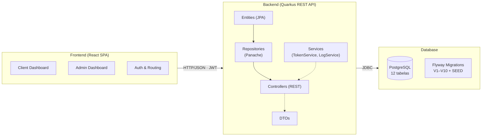
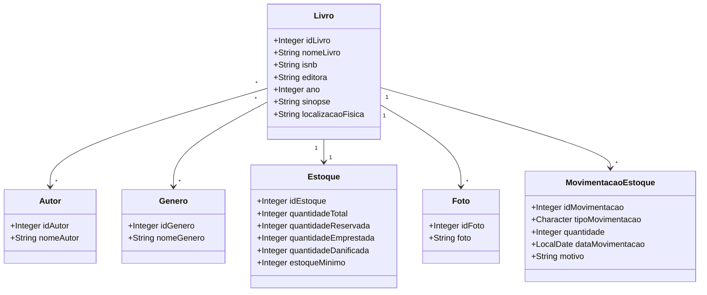
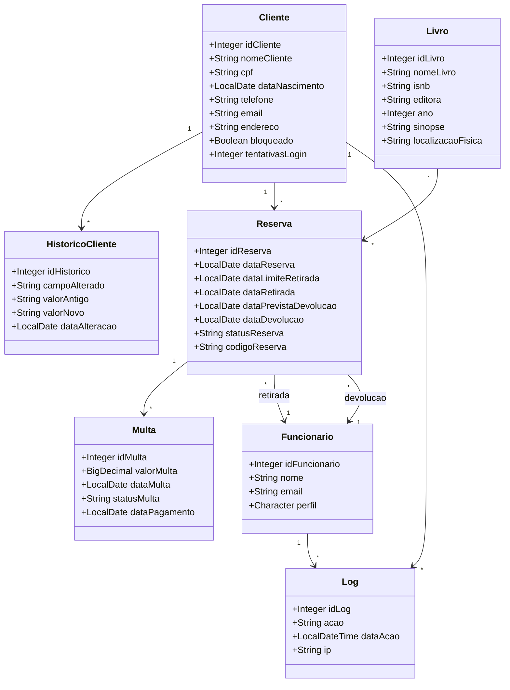

# Biblioteca

**Sistema de Gerenciamento de Biblioteca**

Programação Orientada a Objetos

  
Bruno Pereira de Souza · Fernando Petri · Jhonatan Rosendo

  
Jonathan Martins Melgar · Michelli Segantini

---
transition: slide-left
---

# Agenda

1. **Apresentação do Projeto**
2. **Motivação**
3. **Tecnologias**
4. **Arquitetura do Sistema**
5. **Diagrama de Classes**

6. **Funcionalidades Principais**
8. **Demonstração do Sistema**
9. **Conclusão**
10. **Perguntas**

---
transition: slide-left
layout: two-cols-header
---

# Apresentação do Projeto

::left::

**O que é?**

Sistema full-stack para gerenciamento de bibliotecas físicas, desenvolvido como projeto acadêmico na disciplina de POO.

**Propósito**

Automatizar o ciclo completo de uma biblioteca: cadastro de acervo, controle de estoque, reservas de livros, geração automática de multas e auditoria de operações.

::right::

**Perfis de Acesso**

- **Clientes** — consultam o catálogo e realizam reservas
- **Funcionários** — gerenciam as operações da biblioteca (Admin, Gerente, Staff)

**Escopo**

Backend (API REST) + Frontend (SPA React) + Banco de Dados (PostgreSQL)

---
transition: slide-left
layout: two-cols-header
---

# Motivação

::left::

**Problema**

Muitas bibliotecas físicas ainda operam com sistemas legados, planilhas ou controle manual, resultando em:

- Ineficiência operacional
- Dificuldade no rastreamento de reservas e devoluções
- Controle de estoque impreciso
- Processo manual de cobrança de multas

::right::

**Solução**

Criar uma aplicação modernizada que unifica:

- Cadastro centralizado de livros, autores e gêneros
- Controle de estoque em tempo real
- Sistema de reservas com máquina de estados
- Geração automática de multas por atraso
- Histórico e logs de auditoria
- Autenticação JWT com dois perfis de acesso

---
transition: slide-left
---

# Tecnologias

### Backend

| Tecnologia | Versão |
|------------|--------|
| Java | 21 |
| Quarkus | 3.32 |
| Hibernate Panache | — |
| PostgreSQL | — |
| Flyway | — |
| Maven | — |
| SmallRye OpenAPI | — |
| SmallRye JWT | — |

### Frontend

| Tecnologia | Versão |
|------------|--------|
| React | 19 |
| Vite | 7 |
| Tailwind CSS | 4 |
| React Router | 7 |
| Axios | — |
| FontAwesome | 7 |
| ESLint | 9 |

### Ferramentas

| Tecnologia | Uso |
|------------|-----|
| Git | Controle de versão |
| GitHub | Repositório remoto |
| Swagger UI | Documentação da API |
| Maven Wrapper | Build padronizado |
| Flyway | Migrations |

---
zoom: 0.75
transition: slide-left
---

# Arquitetura do Sistema

---
zoom: 0.65
transition: slide-left
---

# Diagrama de Classes — Acervo

---
zoom: 0.5
transition: slide-left
---

# Diagrama de Classes — Operações

---
transition: slide-left
---

# Funcionalidades Principais

- **Autenticação JWT** com BCrypt e proteção contra brute-force (bloqueio após 5 tentativas)
- **Perfis de acesso**: Admin (A), Gerente (G), Staff (F), Cliente \(C\)
- **Controle de estoque** com contadores atualizados atomicamente a cada transação
- **Geração automática de multas** vinculadas ao status da reserva
- **Auditoria**: Logs de todas as operações e histórico de alterações de clientes
- **Documentação automática da API** via Swagger UI
- **Validação de dados** com Hibernate Validator
- **CRUD genérico** no frontend administrativo

---
transition: slide-left
---

# Demonstração do Sistema

## Sistema em Funcionamento

A demonstração será apresentada ao vivo com o sistema rodando localmente.

**Fluxo demonstrado:**

1. **Autenticação** — login como cliente e como funcionário
2. **Catálogo** — navegação e busca de livros
3. **Reserva** — cliente realiza uma reserva
4. **Administrativo** — funcionário gerencia retirada e devolução
5. **Multas** — geração automática e visualização
6. **Estoque** — verificação dos contadores em tempo real

---
transition: slide-left
---

# Conclusão

### O que foi aprendido

- **POO na prática** — encapsulamento, herança (PanacheEntityBase), relacionamentos JPA
- **Arquitetura em camadas** — separação clara entre Entity, Repository, Controller e DTO
- **Padrões de projeto** — Repository Pattern, State Machine, DTO, Injeção de Dependência
- **Tecnologias modernas** — Java 21, Quarkus, React 19, JWT

### Resultados

- Sistema funcional com **54 classes Java** organizadas em **13 módulos**
- **12 tabelas** no banco de dados gerenciadas via Flyway
- **2 interfaces** (cliente e administrativo) em React
- API documentada automaticamente com Swagger
- Código disponível no GitHub

---
transition: fade-out
layout: center
---

# Obrigado!

**Repositório:** [github.com/anomalyco/Biblioteca](https://github.com/anomalyco/Biblioteca)

